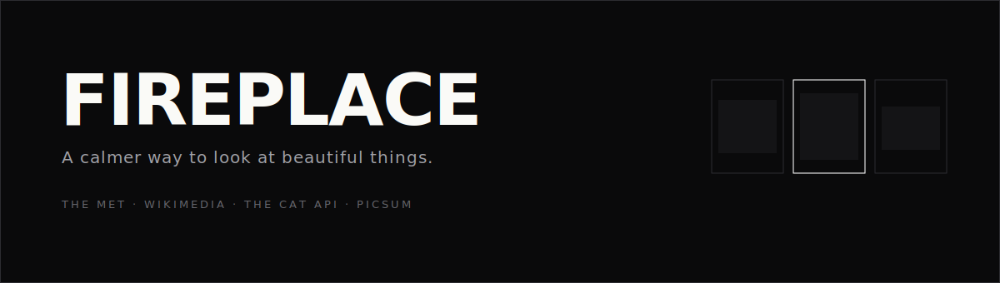

<div align="center">



# 🔥 FirePlace

FirePlace is a **mindful image feed** for Android, built with Flutter. It pulls high‑quality photography from Reddit into a warm, hand‑crafted gallery — the visual joy of Instagram, without the algorithms, ads, vanity metrics, or the bottomless scroll that keeps you there.

No account. No tracking. No feed designed to trap you. Just the things you love, tended like a small fire.

[](https://flutter.dev)
[](https://dart.dev)
[](#the-design--ember--ash)
[](#running-it)
[](LICENSE)

</div>

---

## Why FirePlace exists

Social feeds are engineered to be endless. They measure success in *time‑on‑app*, so every design decision — infinite scroll, autoplay, like counts, streak anxiety — quietly pulls in one direction: **look more**.

FirePlace inverts that. Every decision here is built to help you **look less, and enjoy it more**:

- Content comes in **curated batches**, not a bottomless well. Each batch ends with a designed, unhurried stopping point.
- There are **no visible like counts or follower numbers** anywhere — nothing to compare, nothing to chase.
- A gentle **screen‑time budget** cools from warm ember to calm sage as you approach it — a reward for a good session, never a punishing red alarm.
- When you've browsed a while, a **Wind‑Down** breathing moment invites you to rest, rather than nagging.

The result is an app that feels like settling into a chair by a low fire — warm, quiet, and happy to let you leave.

---

## The design — *Ember & Ash*

FirePlace is dressed in a bespoke design system called **Ember & Ash**: a warm editorial hearth. It's the deliberate opposite of the cold, blue‑white glare of most social apps.

| | |
|---|---|
| **Mood** | A leather chair beside a low fire at night. Warm charcoal shadows, a slow amber glow breathing at the edges, cream serif headlines set like a well‑printed magazine. |
| **Colour** | Layered *ash* backgrounds and an **ember gradient** (amber → coral → rose) for every accent. Both light and dark themes are drawn by hand — never pure black, never pure white. |
| **Type** | A two‑voice system: **Fraunces** (a high‑contrast serif) is the human voice for headlines and numbers that matter; **Inter** is the functional voice for chrome. |
| **The frame rule** | Every photograph is matted on a near‑black *ink frame* with a 1px hairline — in *both* themes — so unpredictable Reddit imagery always reads as *a hung print*, not a raw thumbnail. |

### Signature moments

- **🔥 The Living Hearth** — the glow at the top of the feed isn't an image. It's a `CustomPainter` fire of drifting, blurred embers, driven by a *single* app‑wide 6‑second clock shared across the feed, profile, and empty states. It's the brand, drawn on the GPU, and it costs almost nothing.
- **✨ Ember‑burst like** — double‑tap a print and a shower of amber embers rises and fades while the heart overshoots into place, with a soft haptic tick.
- **📖 Two‑voice title promotion** — a post's title is dense, utilitarian Inter in the feed, then *promotes* to a Fraunces italic pull‑quote when you open it. A small luxury that rewards tapping in.
- **🖼 Hero print‑lift** — tapping a card lifts the print off the wall into full‑screen, easing its corner radius open as it flies.
- **🫧 Wind‑Down** — the break moment is a real box‑breathing pacer (a 4s‑in / 6s‑out ring) over a dimmed hearth, not a blunt dialog.

> **A note on how this was designed:** the Ember & Ash system was chosen from four fully‑developed candidate directions (warm editorial, wellness‑minimalist, bold gallery, and glassmorphism), scored by an independent design panel on distinctiveness, cohesion, and buildability, then synthesised into a single opinionated brief — the winner's backbone grafted with the best ideas from the others.

### See it

**[▶ Open the interactive design preview →](https://claude.ai/code/artifact/278d8326-0b10-4295-8249-23cd682b78da)** — a faithful, self‑contained walk‑through of every screen (onboarding, feed, detail, and Your Hearth) plus the full palette and type. The source lives at [`docs/design-preview.html`](docs/design-preview.html) — open it in any browser.

> Device screenshots can be regenerated any time with `flutter run` on a connected Android device. Screens from the previous design are kept in [`docs/legacy/`](docs/legacy).

---

## Features

**Browse**
- 🎨 **Interest onboarding** — light up as many of **33 interests** (cats, cars, photography, space, food, anime…) as you like; each maps to a hand‑picked set of 4–8 subreddits.
- 📰 **Curated feed** — single‑column matted prints with clean titles, museum‑label attribution, and quiet like/save actions that only take on colour when touched.
- 🧭 **Explore** — a two‑column masonry wall with a scrolling filter of ember chips; switching a category re‑kindles the grid.
- 🔍 **Immersive detail** — pinch‑to‑zoom full‑bleed viewing, serif title, real "time ago", and a one‑tap link back to the Reddit source.
- 🔖 **Saved prints** — bookmark anything to a personal matted wall, stored entirely on‑device.

**Mindful by design**
- ⏳ **Cooling budget ring** — today's time sits inside a ring that cools ember → sage as you approach your chosen budget.
- 🟢 **Calm‑day streaks** — days spent under budget light up as sage embers. Positive reinforcement for looking *less*.
- 🫧 **Wind‑Down breathing** — a gentle box‑breathing pacer when you've browsed past your budget.
- 🛑 **Batches, not bottomless** — the feed ends on purpose; more content is always a deliberate choice.
- 🎚 **Friendly budget presets** — "How long feels good?" (15 / 30 / 45 / 60 min) instead of a cold settings dropdown.

**Craft**
- 🌗 Hand‑drawn light **and** dark themes via a `ThemeExtension`.
- 🤙 Ambient haptics on ignite, like, and navigation.
- ♿ Honours the OS **reduce‑motion** setting — idle glows park themselves.
- 🧼 A `cleanTitle()` pass strips Reddit noise (`[1440x1920]`, `[OC]`, pasted URLs) from every label.

---

## Architecture

A pragmatic, layered Flutter architecture — easy to reason about, easy to extend.

```
UI  ─────────  screens/ + widgets/          Stateless where possible; one
                                             reusable component library.
State  ──────  providers/ (Riverpod)         StateNotifiers for feed, interests,
                                             saved posts, screen-time & budget.
Services  ───  services/                     RedditService (HTTP + JSON),
                                             ContentAggregator (fan-out, cache,
                                             de-dupe), Storage, ScreenTime.
Data  ───────  models/ + Hive + Prefs        Local NoSQL for saved prints &
                                             usage; hand-written TypeAdapters.
Design  ─────  design/                        EmberColors tokens, EmberText,
                                             the Ember & Ash ThemeData.
```

**Engineering highlights**

- **One shared animation clock.** Instead of every glowing surface spinning its own ticker, a single `HearthClock` (`InheritedWidget` + one `AnimationController`) is provided above the whole app and consumed by every ember painter — cheap on GPU and battery, and it respects reduce‑motion centrally.
- **Design as data.** All colour, type, spacing, radius, and motion live in a typed `ThemeExtension` and token classes, so the entire look is swappable and consistent (`context.ember.coral`, `EmberText.serifQuote(...)`).
- **Collision‑safe Hero tags.** Because all three tabs stay alive in an `IndexedStack`, hero tags are namespaced per surface (`feed_…`, `explore_…`, `saved_…`) so the same post can appear in several places without clashing during the print‑lift transition.
- **Resilient aggregation.** `ContentAggregatorService` fans out to two random subreddits per interest in parallel, caches each response for 10 minutes, de‑dupes by id, and degrades gracefully when a subreddit fails.
- **Forward‑compatible storage.** The hand‑written Hive `FeedItemAdapter` reads missing fields with defaults, so saved prints survive schema growth.

---

## Tech stack

| Area | Choice |
|---|---|
| Framework | **Flutter** (Dart) |
| State management | **Riverpod** |
| Local storage | **Hive CE** (saved prints, screen time) + **SharedPreferences** (settings) |
| Networking | **http** against Reddit's public JSON API (no key) |
| Images | **cached_network_image** |
| Typography | **google_fonts** — Fraunces + Inter |
| Motion | **flutter_animate** + hand‑rolled `CustomPainter`s & `Hero` flights |
| Masonry | **flutter_staggered_grid_view** |
| Misc | **timeago**, **intl**, **url_launcher**, **shimmer** |

---

## Project structure

```
lib/
  main.dart                     App bootstrap (Hive, Riverpod, services)
  app.dart                      MaterialApp + shared HearthTicker

  design/
    ember_theme.dart            EmberColors ThemeExtension, EmberText, ThemeData
    ember_tokens.dart           Spacing / radius / motion scales

  core/
    text_utils.dart             cleanTitle() + museum-label formatting

  models/                       FeedItem, Interest, ScreenTimeEntry, Hive adapters
  services/                     Reddit, ContentAggregator, Storage, ScreenTime
  providers/                    Riverpod state (feed, explore, interests, saved, budget)

  widgets/                      The Ember & Ash component library
    hearth.dart                 Shared clock + Living Hearth painter
    framed_photo.dart           The ink-frame matting rule + Hero flight
    print_card.dart             The feed's matted print unit
    ember_burst.dart            Double-tap ember-burst like
    budget_ring.dart            Cooling ember→sage ring
    ember_bars.dart             Weekly chart
    hearth_sheet.dart           Wind-Down breathing sheet
    ember_controls.dart         EmberButton / EmberChip
    ignitable_tile.dart         Onboarding "coals"
    museum_label.dart           Attribution fingerprint

  screens/
    onboarding/  feed/  explore/  detail/  profile/  shell/
```

---

## Running it

```bash
# Requires Flutter 3.41+ (Dart 3.11+)
flutter pub get
flutter run              # on a connected Android device or emulator
```

FirePlace needs no API keys — it talks only to Reddit's public JSON endpoints. Everything you save lives on your device.

```bash
flutter analyze          # static analysis (clean)
flutter build apk        # release build
```

---

## Roadmap

- Bundle the fonts for a fully offline first launch.
- A true "evening mode" that warms the palette one notch after a set hour.
- A weekly "your fire this week" reflection card.
- An optional home‑screen widget for the calm‑day streak.

---

## Credits & licence

Photography is served from Reddit's public API and belongs to its original posters — attribution is shown on every print and links back to the source. FirePlace is a personal, non‑commercial project and is not affiliated with Reddit or Instagram.

Released under the [MIT License](LICENSE).

<div align="center">
<br>
<em>Tend a smaller fire. 🔥</em>
</div>
