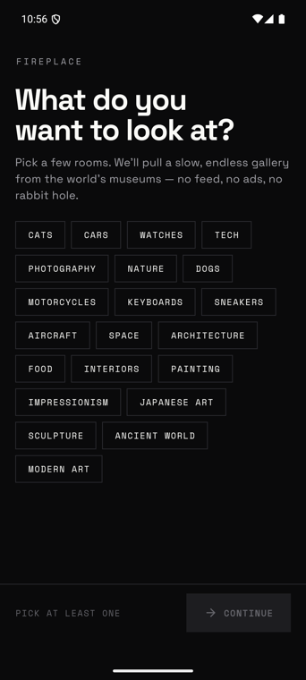
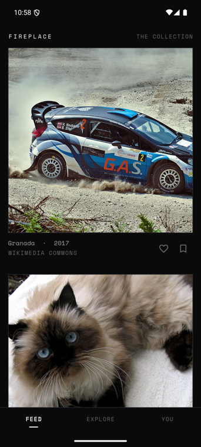
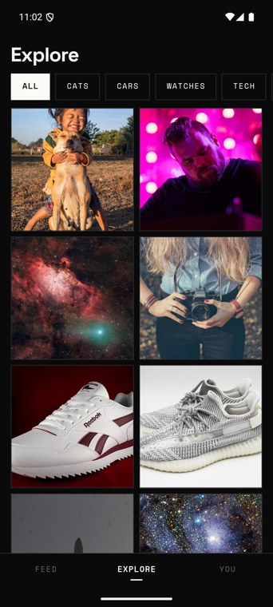
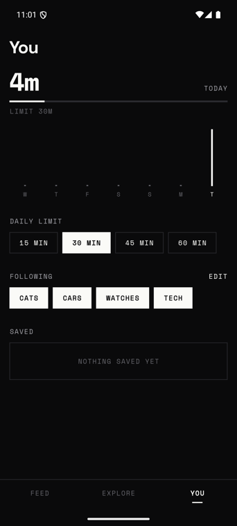

<div align="center">


# FirePlace

**A slow, monochrome gallery for Android — a calmer way to look at beautiful things.**

FirePlace is the anti‑Instagram: a quiet, black‑and‑white gallery that pulls *real* images — fine art, cars, cats, watches, tech, photography — from public collections, and shows them like framed prints on a wall. No accounts, no ads, no algorithm, no bottomless scroll. Just the things you like, on purpose.

[](https://flutter.dev)
[](https://dart.dev)
[](#the-look--gallery)
[](#running-it)
[](LICENSE)

</div>

---

## Screens

<div align="center">

&nbsp;

&nbsp;

&nbsp;

</div>

<div align="center"><em>Onboarding · Feed · Explore · You — real screenshots, running on a Pixel 8.</em></div>

---

## Why

Social feeds are built to be endless — they win when you *look more*. FirePlace is built the other way: to help you **look less, and enjoy it more**.

- **Curated batches, not infinite scroll.** Each batch ends on purpose, with a designed stopping point.
- **No vanity metrics.** No like counts, no followers — nothing to chase.
- **A gentle session limit.** A tiny tabular readout of today's time against a limit you set; browse past it and a quiet "step away" sheet appears.
- **You own the shape of it.** Follow the rooms you like; everything you save lives on your device.

## The look — *Gallery*

A strict **monochrome** system: near‑black `#0A0A0B` and bone‑white `#FAFAF7`, a wide **Space Grotesk** display paired with **Space Mono** wall‑labels, hard edges, a tight grid, and crisp snap/crossfade motion. There is no accent colour — **the artwork is the only colour on screen**, and emphasis comes from weight and *inversion* (an ink block with paper text) rather than a coloured rail. Everything's a typed `ThemeExtension` (`context.c.ink`), with a full light theme too.

## Content — real images from four keyless APIs

Every image is real and attributed. FirePlace routes each category to the right source:

| Source | Powers | Wall‑label metadata |
|---|---|---|
| **The Met** — open collection | Painting, Impressionism, Japanese, Sculpture, Ancient, Modern | title · artist · date · medium |
| **Wikimedia Commons** | Cars, Watches, Tech, Dogs, Motorcycles, Keyboards, Sneakers, Aircraft, Space, Architecture, Food, Interiors, Nature | title · photographer · year · license |
| **The Cat API** | Cats | — |
| **Lorem Picsum** | Photography + a resilient fallback | — |

Adding a new room is one line in [`constants.dart`](lib/constants.dart):

```dart
Interest(id: 'guitars', label: 'Guitars', source: Source.wikimedia, query: 'electric guitar'),
```

## Features

- 🖼 **Feed** — a single column of framed plates (art is matted whole; photos fill the frame) with a Space Mono wall‑label; double‑tap to like, quiet save.
- 🔎 **Explore** — a tight grid with category filters that invert when active.
- 🔬 **Detail** — the work full‑width with a museum‑style label beneath, pinch‑to‑zoom, and a link back to the source.
- 🧭 **You** — today's session against your limit, a bare week chart, friendly presets, the rooms you follow, and your saved wall.
- ♿ Honours OS **reduce‑motion**; screen‑reader labels on the controls; WCAG‑minded monochrome contrast.

## Architecture

```
UI      screens/ + widgets/     stateless where possible; one component library
State   providers/ (Riverpod)   feed, explore, follows, saved, session + limit
Data    services/               MetService · WikimediaService · CatService ·
                                PicsumService · GalleryService (the blender)
Model   models/ + Hive + Prefs  FeedItem, categories; local saves & screen time
Design  design/                 GalleryColors tokens, Type, GalleryTheme
```

**Engineering notes**
- **`GalleryService` is the blender** — it samples the categories you follow, fans out to each source *in parallel*, dedupes by id, and shuffles. Each source lives behind its own small client and fails soft (a dead source returns `[]`, never crashes the feed).
- **Resilient by default** — Met search retries once on an empty body; if everything is unreachable the feed falls back to photographs so it's never blank.
- **Wikimedia needs a User‑Agent** — image requests carry one (`kImageHeaders`), or Commons 403s them.
- **Collision‑safe Hero tags** — because all three tabs stay alive in an `IndexedStack`, hero tags are namespaced per surface (`feed_…`, `explore_…`, `saved_…`).

## Tech stack

**Flutter** · **Riverpod** (state) · **Hive CE** + **SharedPreferences** (local) · **http** (four public APIs, no keys) · **cached_network_image** · **google_fonts** (Space Grotesk + Space Mono) · **flutter_animate** · **shimmer** · **intl** · **url_launcher**.

## Running it

```bash
flutter pub get
flutter run          # a connected Android device or emulator
```

No API keys required — every source is public. Everything you save stays on your device.

```bash
flutter analyze      # clean
flutter test         # unit tests for the model
flutter build apk    # release build
```

## Roadmap

- More rooms (guitars, interiors, typography, maps…) — each a one‑liner.
- Cache fetched Met objects to cut repeat network on paging.
- Bundle the two fonts for a fully offline first launch.
- A "shuffle everything" mode that ignores follows.

## Credits & licence

Images belong to their institutions and creators — **The Met** (open access), **Wikimedia Commons** contributors (CC/public‑domain), **The Cat API**, and **Lorem Picsum**; attribution and a source link are shown on every work. FirePlace is a personal, non‑commercial project, not affiliated with any of them.

Released under the [MIT License](LICENSE).

<div align="center"><br><em>Look at fewer things, more slowly.</em></div>
