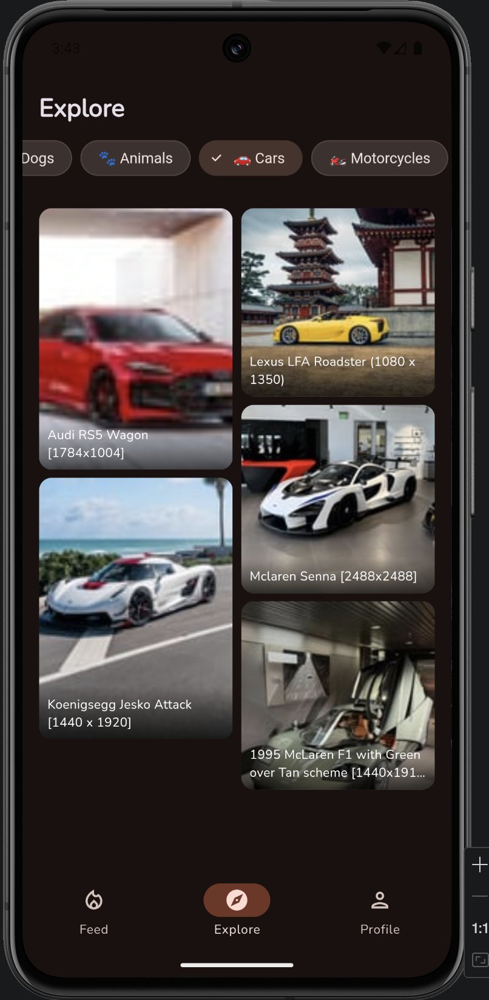
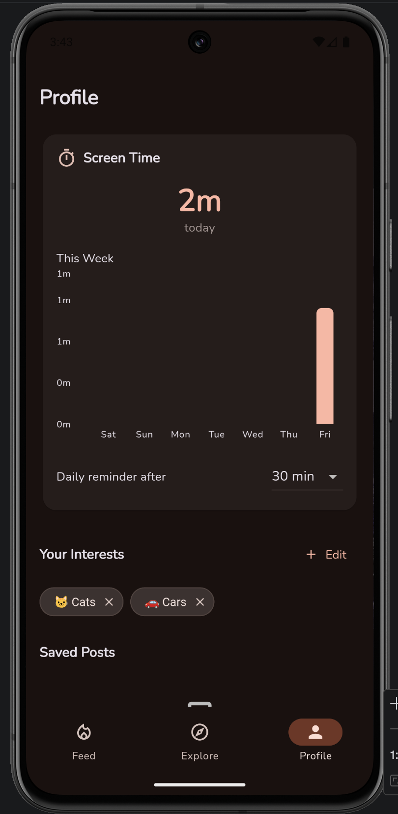

# FirePlace

An Instagram alternative Android app built with Flutter. FirePlace gives you a curated, interest-based image feed powered by Reddit — no accounts, no algorithms, no ads, no doom-scrolling.

The goal is to offer the visual browsing experience people enjoy about Instagram, but with intentional content curation and built-in screen time awareness to help break addictive social media habits.

## Features

- **Interest-based onboarding** — Pick from 30+ categories (cats, cars, photography, anime, memes, etc.) to build your personalized feed
- **Curated Reddit feed** — Pulls high-quality image posts from 180+ subreddits mapped to your interests
- **Explore page** — Masonry grid layout with category filters to discover new content
- **Full-screen post viewer** — Tap any post for an immersive view with pinch-to-zoom
- **Double-tap to like** — Instagram-style heart animation on double-tap
- **Save posts** — Bookmark posts locally, view them in your profile
- **Screen time tracking** — Live usage timer, weekly bar chart, and configurable reminders
- **Gentle usage reminders** — Non-judgmental "time for a break?" dialog after your set threshold
- **Dynamic theming** — Follows your device's light/dark mode with Material Design 3
- **No account required** — Everything is stored locally on your device

## Screenshots






## Interest Categories

| | | | |
|---|---|---|---|
| Cats | Dogs | Animals | Cars |
| Motorcycles | Photography | Art | Digital Art |
| Nature | Ocean | Weather | Plants |
| Food | Coffee | Travel | Fitness |
| Fashion | Architecture | Interior Design | Space |
| Technology | Science | Gaming | Anime |
| Movies & TV | Music | Memes | Sports |
| Woodworking | DIY | Aesthetics | Maps |
| History | | | |

Each category is mapped to 4-8 popular subreddits for content variety.

## Tech Stack

- **Flutter** (Dart) — Cross-platform UI framework
- **Riverpod** — State management
- **Hive CE** — Local NoSQL database for saved posts and screen time
- **SharedPreferences** — Lightweight key-value storage for settings
- **Reddit JSON API** — Public endpoint, no API key needed
- **Material Design 3** — Dynamic color theming
- **fl_chart** — Screen time bar charts
- **cached_network_image** — Image caching and placeholders

## Project Structure

```
lib/
  main.dart                 # App entry point, Hive/Riverpod init
  app.dart                  # MaterialApp with light/dark theming
  theme.dart                # Material 3 dynamic theme config
  constants.dart            # 30+ interest definitions with subreddit mappings

  models/
    interest.dart           # Interest data class
    feed_item.dart          # Universal content card model
    content_source.dart     # Content source enum
    screen_time_entry.dart  # Daily usage record
    hive_adapters.dart      # Hive TypeAdapters for persistence

  services/
    reddit_service.dart     # Reddit public JSON API client
    content_aggregator_service.dart  # Fetches, shuffles, caches content
    storage_service.dart    # Hive + SharedPreferences wrapper
    screen_time_service.dart  # Stopwatch-based usage tracker

  providers/
    interests_provider.dart   # Selected interests state
    feed_provider.dart        # Feed with pagination
    explore_provider.dart     # Category-filtered explore content
    saved_posts_provider.dart # Persisted saved posts
    screen_time_provider.dart # Live screen time stream

  screens/
    onboarding/             # Interest selection screen
    feed/                   # Main scrollable feed with shimmer loading
    explore/                # Masonry grid with category chips
    detail/                 # Full-screen post viewer
    profile/                # Screen time chart, saved posts, interest manager
    shell/                  # Bottom navigation bar

  widgets/
    source_attribution.dart   # Reddit author credit
    like_save_buttons.dart    # Heart and bookmark icons
    usage_reminder_dialog.dart # "Time for a break?" dialog
    empty_state.dart          # Empty state placeholder
```

## Getting Started

### Prerequisites

- [Flutter SDK](https://docs.flutter.dev/get-started/install) (3.10+)
- Android Studio or VS Code with Flutter plugin
- An Android device or emulator

### Run

```bash
# Clone the repo
git clone https://github.com/46312439/FirePlace.git
cd FirePlace

# Create the .env file (Reddit needs no API key)
echo "REDDIT_USER_AGENT=FirePlace/1.0" > .env

# Get dependencies
flutter pub get

# Run on a connected device or emulator
flutter run
```

### Build APK

```bash
flutter build apk --release
```

The APK will be at `build/app/outputs/flutter-apk/app-release.apk`.

## How It Works

1. **Onboarding** — User picks interests from a grid of emoji-labeled chips
2. **Feed generation** — For each interest, the app picks 2 random subreddits from its mapping, fetches hot image posts via Reddit's public JSON API, then shuffles and deduplicates everything into one mixed feed
3. **Caching** — API responses are cached in-memory for 10 minutes to avoid redundant requests
4. **Screen time** — A `Stopwatch` tracks active usage, persists to Hive every 30 seconds, and pauses when the app goes to background
5. **Reminders** — After the configurable threshold (default 30 min), a gentle dialog suggests taking a break

## Contributing

Contributions are welcome! Feel free to open issues or submit pull requests.

## License

This project is open source under the [MIT License](LICENSE).

You're free to use, modify, and distribute this project — just include the original copyright notice and link back to this repo:

```
Copyright (c) 2026 46312439
https://github.com/46312439/FirePlace
```
